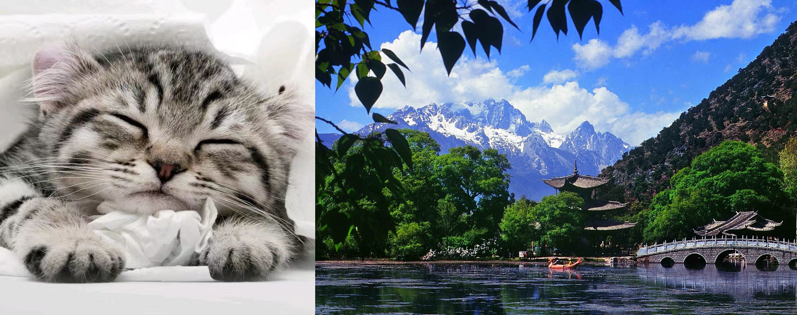
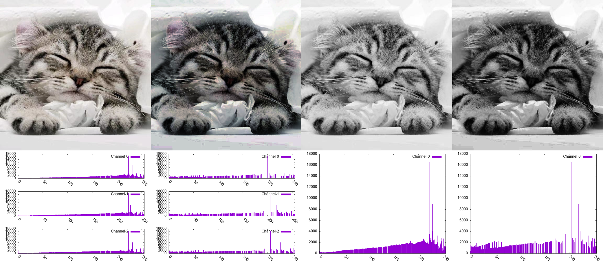
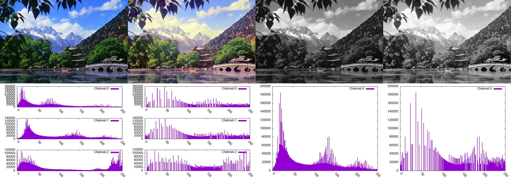
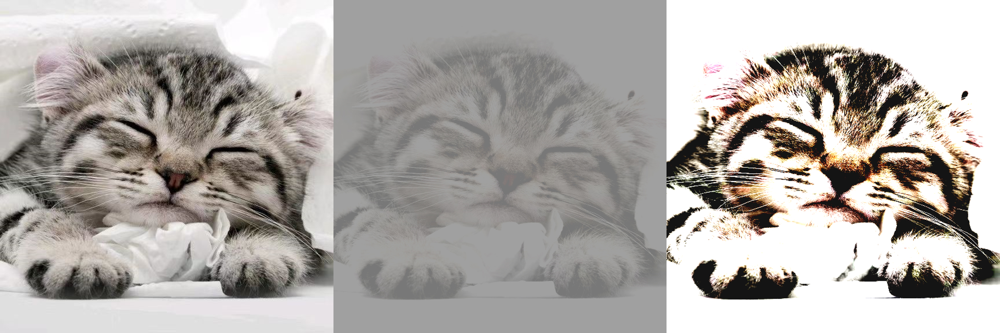
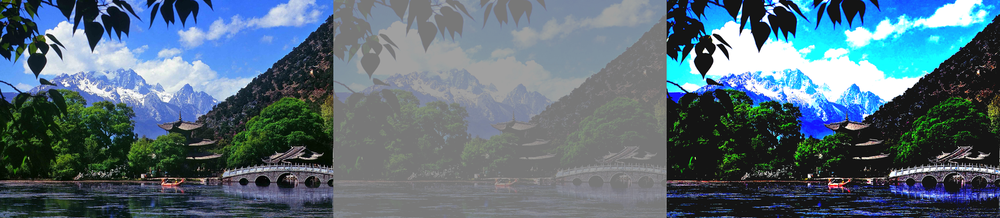

# 数组图像处理作业一
## 实验目标
编程实现简单的图片点变换：直方图均衡化、图片线性拉伸。
+ 加载一张图片
+ 对图片做直方图均衡化
+ 对图片进行线性拉伸
+ 记录并展示结果

## 实验工具
+ 语言：C++
+ Visual Studio 2022
+ 第三方工具：加载图片使用stbi_image库，Gnuplot进行简单的直方图绘制

## 实验原理
### 直方图均衡化
直方图均衡化试图让每个通道的直方图尽可能平衡，也就是每个像素级在所有像素中的占比相近。直方图均衡化是点变换的一种，假设原图的像素级归一化后为$t$，而均衡化后的归一化像素级为 $s$，变换为：$s=T(r)$. 略去推导过程，变换$T(\cdot)$为：
$$
s=T(r)=\int_0^rP_r(r)dr
$$
其中，$P_r(r)$是直方图中r的概率密度。可以看出 $T(r)$ 实际上就是r的概率分布函数。

最后，把实数的归一化像素级转化为离散的整数像素值，缩放并取整。

直方图均衡化可以让图片色彩显得更加饱满丰富，但可能损失细节，让色彩过渡不自然。

### 点变换：线性拉伸
线性拉伸就是对像素值做简单的线性变换。假设原本的范围是(a,b)，需要变换到(c,d)，原值是x，新值是y，则：
$$
\begin{aligned}
    y=f(x)=\begin{cases}
        c,&x\le a \\
        \frac{x-a}{b-a}(d-c)+c, &a<x<b \\
        d,&x\ge b
    \end{cases}
\end{aligned}
$$

## 实验流程
1. 引入stbi_image.h、stbi_image_write.h两个库，用于图片的读取与保存。stbi_image能直接把图片读入为内存中的数组，而stbi_image_write能直接把内存中的数组保存为jpg, png等格式的图片。stbi_image库的好处是配置便利。
2. 使用stbi_image.h读取图片，直接读取为数组，供之后的变换。
3. 根据所读取的图片计算直方图，对直方图进行直方图均衡化，得到直方图均衡化的函数。
4. 对读取的图片应用前一步的变换。保存新图。绘制变换前后的各通道直方图。
5. 给定线性变换的原上下界和变换后上下界，进行点线性拉伸，保存图片。
6. 尝试不同的拉伸范围，比较并保存。

## 实现框架
主要是两个类：Image类和Histogram类，前者实现对图片本身的操作，即读取图片、创建图片、保存图片，对图片应用点变换，后者用于直方图操作，如计算直方图、直方图均衡化、绘制直方图等。

### Image
1. 创建图片。包括从给定的路径读取图片，以及根据宽高通道创建一个全0的新图片。
2. 管理图片内存，读写像素，内存共享，自动销毁等。
3. 输出图片。根据给定路径保存图片。
4. 应用点变换。包括线性拉伸，需给出原上下界、新上下界，以及以look-up table形式给出的点变换。

### Histogram
1. 根据给定的Image对象，统计并创建直方图。
2. 直方图均衡化，并输出变换用的look-up table。
3. 调用gnuplot，向给定的路径绘制各通道直方图。

## 要点、难点与解决
### 图片的读取、保存与内存管理
图片的编解码、保存并不简单，本次实验也不涉及这方面。一些主流的库，如OpenCV, FreeImage等，在windows下配置都不简单。选择使用stb_image，是因为它只有单个.h文件，只需要解决在多个cpp文件引用后链接冲突的问题即可放心使用。

图片的内存管理，包括申请与自动销毁以及共享问题。当设计到多个Image类共享同一块内存中的图片时，自己new, delete管理内存就很困难。使用带引用计数的`shared_ptr`智能指针解决问题。

### 直方图的绘制
画出直方图显然是可视化直方图均衡化的结果的最好方法。但是C++绘图并不简单，各种库的配置和使用都有很多问题。最后为了省事，使用gnuplot。它不是一个库而是一个完整的软件，加入环境变量后，可以通过管道打开，然后向其输入绘制命令，最后保存。

## 实验结果
### 原始图像
选择了两张图片，一张猫咪，一张丽江的黑龙潭公园风景照。

### 直方图均衡化
对两张图片进行直方图均衡化。

猫猫：  

可以看出直方图均衡化后色彩看起来动态范围更大了，更包满了。但色块变得比较“硬”，过渡不自然，存在不自然的色斑——这和原图质量是有关系的。直方图在一定程度上得到了平衡，而整体的形状是难以改变的，比如特别高的峰仍旧是峰。此外，许多临近的像素级被合并了（表现为直方图中的缝隙），这导致直方图均衡化后，实际上的像素级变少了，颜色之间的变化也就比较生硬了。

风景：

原图较暗，像素值大致分布在直方图的左侧。均衡化后更多的像素去到右侧，整个画面看起来更亮了，当然由于我对三个通道的颜色分别进行了均衡化，所以能看出颜色有了比较明显的改变，而前面的猫因为大部分像素偏灰，RGB三个通道差异没那么大，所以对彩色图直方图均衡后未发生如此明显的色彩变化。风景图中，暗部的细节得以凸显，而后面的雪山、天空等则有点过曝的迹象。灰度图类似。

### 线性拉伸
可以对图片进行任意拉伸。此处仅展示尝试的两组拉伸：(50,200)->(120,160)；(100,150)->(20,255). 下面的图中，左边的是原图，中间的是减小范围，右边的拉大范围。

猫猫：

风景：

大范围缩成小范围，呈现一种朦胧的影调，过度可能无法看清；如果范围缩的过小，则会仿佛在照片前蒙上了一层灰膜。小范围拉成大范围，可以凸显一些处于范围内的像素区域的细节，但整体的细节可能会丢失，很多地方可能会变成过曝的死白。具体的使用，需要根据直方图尝试，否则可能出现大面积过曝或者欠曝效果。

## 总结
使用C++实现了图片的直方图均衡化算法，实现了线性点变换。这些简单的方法可以说是构成图片后期技术的基础之一，尤其感受到了直方图的妙用，图片给人怎么样的感觉，很大程度上从直方图就可以看出来。

此外，实现算法并未考虑优化问题，导致计算在尺寸较大的图片上较慢。

最后，windows下C++配置库(比如opencv，绘图库等)确实麻烦，虽然这次图省事用了stbi_image，gnuplot等，恐怕未必能满足以后的需求，可能总之需要配置的。